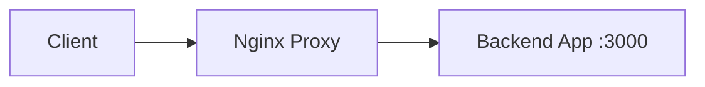
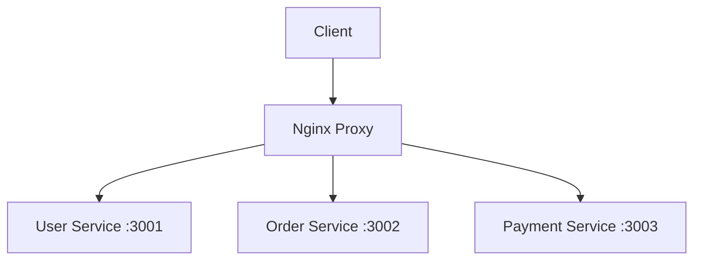
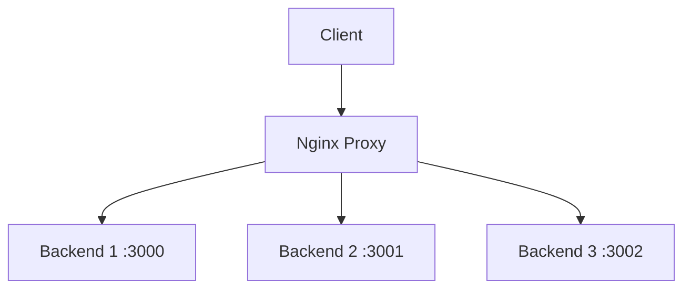

# Reverse Proxy Setup - Connect Backend Applications

Learn how to use Nginx Site Manager as a reverse proxy to connect your backend applications (Node.js, Python, PHP-FPM, etc.) to the web with SSL, load balancing, and advanced routing.

## What You'll Learn

- Reverse proxy fundamentals
- Connect Node.js, Python, and other backend apps
- Advanced routing and path-based proxying
- SSL termination for backends
- Health checks and failover
- WebSocket proxying

## Prerequisites

- Basic understanding of backend applications
- A running backend application (we'll create examples)
- Nginx Site Manager installed and configured
- Domain name configured (recommended)

## Understanding Reverse Proxy

### What is a Reverse Proxy?

A reverse proxy sits between clients and your backend servers:

```
Client → Nginx (Reverse Proxy) → Backend Application
```

**Benefits:**
- 🛡️ **Security**: Hide backend servers from direct access
- 🚀 **Performance**: Caching, compression, load balancing  
- 🔒 **SSL Termination**: Handle SSL at proxy level
- 🔄 **Load Balancing**: Distribute requests across multiple backends
- 📊 **Logging**: Centralized request logging and monitoring

## Step 1: Prepare Your Backend Application

Let's create example backend applications to proxy to:

### Option A: Node.js Express App

Create a simple Node.js application:

```javascript
// app.js
const express = require('express');
const app = express();
const PORT = 3000;

app.use(express.json());

// Basic routes
app.get('/', (req, res) => {
    res.json({ 
        message: 'Hello from Node.js backend!',
        timestamp: new Date().toISOString(),
        headers: req.headers
    });
});

app.get('/api/users', (req, res) => {
    res.json([
        { id: 1, name: 'John Doe', email: 'john@example.com' },
        { id: 2, name: 'Jane Smith', email: 'jane@example.com' }
    ]);
});

app.post('/api/users', (req, res) => {
    const user = req.body;
    user.id = Date.now();
    res.status(201).json({ message: 'User created', user });
});

app.listen(PORT, () => {
    console.log(`Backend server running on http://localhost:${PORT}`);
});
```

Run the application:
```bash
# Install dependencies
npm init -y
npm install express

# Start the server
node app.js
```

### Option B: Python Flask App

Create a Python Flask application:

```python
# app.py
from flask import Flask, jsonify, request
from datetime import datetime
import json

app = Flask(__name__)

@app.route('/')
def home():
    return jsonify({
        'message': 'Hello from Python Flask backend!',
        'timestamp': datetime.now().isoformat(),
        'headers': dict(request.headers)
    })

@app.route('/api/data')
def get_data():
    return jsonify([
        {'id': 1, 'name': 'Product A', 'price': 29.99},
        {'id': 2, 'name': 'Product B', 'price': 39.99}
    ])

@app.route('/api/data', methods=['POST'])
def create_data():
    data = request.json
    data['id'] = int(datetime.now().timestamp())
    return jsonify({'message': 'Data created', 'data': data}), 201

if __name__ == '__main__':
    app.run(host='127.0.0.1', port=5000, debug=True)
```

Run the application:
```bash
# Install Flask
pip install flask

# Start the server
python app.py
```

### Option C: Existing Application

If you have an existing application running on a port (e.g., Django on :8000, Ruby on Rails on :3000), note the port number.

## Step 2: Create Reverse Proxy Site

### 2.1 Create New Site

1. **Access Nginx Site Manager** dashboard

2. **Click "Create New Site"**

3. **Basic Information**:
   - **Site Name**: `my-backend-app`
   - **Domain**: `api.your-domain.com` (or `your-domain.com/api`)
   - **Site Type**: Select **"Reverse Proxy"**
   - **Description**: `Backend application proxy`

4. **Click "Next"** to configure proxy settings

### 2.2 Configure Proxy Settings

**Backend Configuration**:
- **Backend URL**: `http://127.0.0.1:3000` (Node.js) or `http://127.0.0.1:5000` (Flask)
- **Backend Protocol**: `HTTP` (we'll handle SSL at the proxy level)
- **Health Check Path**: `/` (endpoint to check if backend is healthy)

**Proxy Behavior**:
- **Proxy Path**: `/` (proxy all requests) or `/api` (proxy only API requests)
- **Strip Path**: Choose whether to remove the proxy path before forwarding
- **Timeout**: `30` seconds (adjust based on your backend response time)

**Headers**:
- **Pass Host Header**: ✅ Enabled (forwards original host header)
- **Add X-Forwarded-For**: ✅ Enabled (passes client IP to backend)
- **Add X-Real-IP**: ✅ Enabled (passes real client IP)

## Step 3: Advanced Proxy Configuration

### 3.1 Path-Based Routing

Route different paths to different backends:

**Configuration Example**:
```
Path: /api/users → Backend: http://127.0.0.1:3001 (User service)
Path: /api/orders → Backend: http://127.0.0.1:3002 (Order service)
Path: / → Backend: http://127.0.0.1:3000 (Main app)
```

**Setup**:
1. Create multiple proxy configurations
2. Use different proxy paths
3. Configure path stripping appropriately

### 3.2 Header Manipulation

**Custom Headers**:
- **Add headers**: Add custom headers to backend requests
- **Remove headers**: Strip sensitive headers
- **Modify headers**: Change header values

**Example Headers**:
```
X-Forwarded-Proto: https
X-Forwarded-Port: 443
X-Forwarded-Host: api.your-domain.com
```

### 3.3 SSL Termination

The reverse proxy handles SSL, communicating with backends over HTTP:

```
Client (HTTPS) → Nginx Proxy (SSL Termination) → Backend (HTTP)
```

**Benefits**:
- Simplified backend configuration
- Centralized certificate management
- Better performance (SSL handled by nginx)

## Step 4: Test Your Reverse Proxy

### 4.1 Basic Testing

1. **Activate the site** in Nginx Site Manager

2. **Test the proxy**:
   ```bash
   # Test direct backend (should work)
   curl http://localhost:3000
   
   # Test through proxy
   curl http://your-domain.com
   curl https://your-domain.com  # If SSL enabled
   ```

3. **Check headers** reaching your backend:
   - Your backend should receive forwarded headers
   - Client IP should be preserved
   - Host header should be correct

### 4.2 Verify Header Forwarding

In your backend application, log the received headers:

**Node.js**:
```javascript
app.use((req, res, next) => {
    console.log('Headers:', req.headers);
    next();
});
```

**Python Flask**:
```python
@app.before_request
def log_headers():
    print('Headers:', dict(request.headers))
```

Expected headers:
- `X-Forwarded-For`: Client IP address
- `X-Real-IP`: Client IP address  
- `X-Forwarded-Proto`: `https` or `http`
- `Host`: Your domain name

## Step 5: WebSocket Proxying

For real-time applications using WebSockets:

### 5.1 WebSocket Backend Example

**Node.js WebSocket Server**:
```javascript
const WebSocket = require('ws');
const wss = new WebSocket.Server({ port: 3001 });

wss.on('connection', (ws) => {
    console.log('New WebSocket connection');
    
    ws.on('message', (message) => {
        console.log('Received:', message);
        // Echo message back
        ws.send(`Echo: ${message}`);
    });
    
    // Send periodic updates
    const interval = setInterval(() => {
        ws.send(`Time: ${new Date().toISOString()}`);
    }, 5000);
    
    ws.on('close', () => {
        clearInterval(interval);
    });
});
```

### 5.2 WebSocket Proxy Configuration

1. **Create a new proxy site** for WebSocket
2. **Backend URL**: `http://127.0.0.1:3001`
3. **Enable WebSocket Support**: ✅ 
4. **WebSocket Path**: `/ws` or `/socket.io`

The system automatically adds nginx WebSocket headers:
```nginx
proxy_http_version 1.1;
proxy_set_header Upgrade $http_upgrade;
proxy_set_header Connection "upgrade";
```

## Step 6: Health Checks and Monitoring

### 6.1 Health Check Configuration

**Health Check Settings**:
- **Health Check URL**: `/health` (endpoint in your backend)
- **Check Interval**: `30` seconds
- **Timeout**: `5` seconds
- **Healthy Threshold**: `2` successful checks
- **Unhealthy Threshold**: `3` failed checks

**Backend Health Endpoint**:

**Node.js**:
```javascript
app.get('/health', (req, res) => {
    // Check database, external services, etc.
    const health = {
        status: 'healthy',
        timestamp: new Date().toISOString(),
        uptime: process.uptime(),
        memory: process.memoryUsage()
    };
    res.json(health);
});
```

**Python Flask**:
```python
@app.route('/health')
def health_check():
    return jsonify({
        'status': 'healthy',
        'timestamp': datetime.now().isoformat(),
        'version': '1.0.0'
    })
```

### 6.2 Monitoring and Logs

**Access Logs**: Monitor proxy requests in nginx access logs
**Error Logs**: Check nginx error logs for proxy issues
**Backend Logs**: Monitor your backend application logs
**Health Status**: View health check status in the dashboard

## Advanced Reverse Proxy Patterns

### Pattern 1: Microservices Gateway

Route different services based on path:

```
/api/users → User Service (port 3001)
/api/orders → Order Service (port 3002)
/api/payments → Payment Service (port 3003)
/api/notifications → Notification Service (port 3004)
```

### Pattern 2: Blue-Green Deployment

Switch traffic between two versions:

```
Production: /api → Backend v1 (port 3000)
Staging: /api → Backend v2 (port 3001)
```

### Pattern 3: A/B Testing

Route percentage of traffic to different versions:

```
90% traffic → Version A (port 3000)
10% traffic → Version B (port 3001)
```

### Pattern 4: Load Balancing

Distribute requests across multiple backend instances:

```
Backend Pool:
- Backend 1: 127.0.0.1:3000
- Backend 2: 127.0.0.1:3001
- Backend 3: 127.0.0.1:3002
```

## Troubleshooting Reverse Proxy

### Common Issues

#### 1. 502 Bad Gateway

**Causes**:
- Backend application not running
- Wrong backend URL/port
- Backend application crashed

**Solutions**:
```bash
# Check if backend is running
netstat -tlnp | grep :3000
curl http://localhost:3000

# Check nginx error logs
tail -f /var/log/nginx/error.log

# Restart backend application
```

#### 2. Timeout Errors

**Causes**:
- Backend response too slow
- Long-running requests
- Database queries taking too long

**Solutions**:
- Increase proxy timeout settings
- Optimize backend performance
- Add request queuing
- Implement caching

#### 3. Header Issues

**Causes**:
- Missing forwarded headers
- Incorrect host headers
- Security header conflicts

**Solutions**:
- Verify header configuration
- Check backend header processing
- Add debugging logs

#### 4. WebSocket Connection Failures

**Causes**:
- WebSocket headers not set
- Connection upgrade failed
- Backend doesn't support WebSockets

**Solutions**:
- Enable WebSocket support in proxy
- Verify WebSocket backend configuration
- Check browser WebSocket compatibility

### Debug Commands

```bash
# Test backend directly
curl -v http://localhost:3000

# Test through proxy
curl -v -H "Host: your-domain.com" http://localhost:80

# Check proxy configuration
nginx -t

# Monitor real-time logs
tail -f /var/log/nginx/access.log
tail -f /var/log/nginx/error.log

# Test WebSocket connection
websocat ws://your-domain.com/ws
```

## Security Considerations

### 1. Backend Security

- **Bind to localhost**: Don't expose backends directly to internet
- **Internal networks**: Use private network addresses when possible
- **Authentication**: Implement proper authentication in backends
- **Rate limiting**: Add rate limiting at proxy level

### 2. Header Security

- **Strip sensitive headers**: Remove internal headers before forwarding
- **Add security headers**: CORS, CSP, HSTS headers
- **Validate inputs**: Sanitize forwarded data

### 3. SSL Configuration

- **Strong ciphers**: Use modern SSL/TLS configuration
- **Certificate management**: Keep certificates updated
- **HSTS**: Force HTTPS connections

## Performance Optimization

### 1. Caching

- **Static assets**: Cache images, CSS, JS files
- **API responses**: Cache appropriate API responses
- **Compression**: Enable gzip compression

### 2. Connection Management

- **Keep-alive**: Enable HTTP keep-alive
- **Connection pooling**: Reuse connections to backends
- **Buffer sizes**: Optimize buffer sizes for your use case

### 3. Load Balancing

- **Multiple backends**: Scale horizontally
- **Health checks**: Remove unhealthy backends
- **Session affinity**: Route users to same backend when needed

## What's Next?

Now that you've mastered reverse proxy setup:

1. **[Load Balancing](load-balancing.md)**: Distribute traffic across multiple backends
2. **[Monitoring Setup](monitoring.md)**: Monitor your proxy and backends
3. **[Security Hardening](security-hardening.md)**: Advanced security measures
4. **[API Integration](api-integration.md)**: Manage sites programmatically

## Architecture Examples

### Simple Reverse Proxy


### Microservices Gateway


### Load Balanced Proxy


## Need Help?

- 📖 [Reverse Proxy Documentation](../docs/reverse-proxy.md)
- 🔧 [Troubleshooting Guide](../docs/troubleshooting.md#reverse-proxy)
- 💬 [Community Support](https://github.com/your-username/nginx-manager/discussions)
- 📧 Email: proxy-support@nginx-manager.com

---

**Congratulations!** 🎉 You've successfully set up a reverse proxy to connect your backend applications to the web with SSL and advanced routing.

**Next Tutorial**: [Load Balancing](load-balancing.md) - Scale your application across multiple servers

*Estimated completion time: 20 minutes*