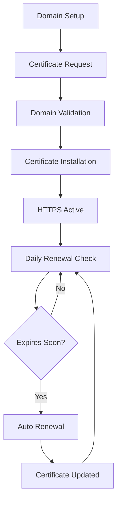

# SSL Setup Guide - One-Click HTTPS

Transform your HTTP site into a secure HTTPS site with automatic SSL certificates from Let's Encrypt. This guide shows you how to enable SSL in just a few clicks.

## What You'll Learn

- How SSL certificates work
- Automatic certificate generation with Let's Encrypt
- Certificate renewal and management
- HTTPS redirection setup
- SSL security best practices

## Prerequisites

- A site already created and running (complete the [First Site Guide](first-site.md) if needed)
- A real domain name pointing to your server (required for Let's Encrypt)
- Ports 80 and 443 open on your firewall
- Valid email address for certificate notifications

## Why SSL Matters

🔒 **Security**: Encrypts data between your visitors and your server
🚀 **SEO**: Google ranks HTTPS sites higher in search results  
✅ **Trust**: Browsers show security warnings for HTTP sites
📱 **Modern Web**: Many APIs and features require HTTPS

## Step 1: Prepare Your Domain

Before requesting an SSL certificate, ensure your domain is properly configured:

### 1.1 Domain DNS Setup

Your domain must point to your server's public IP address:

```bash
# Check your server's public IP
curl ifconfig.me

# Verify DNS resolution (run from any computer)
nslookup your-domain.com
dig your-domain.com
```

The DNS response should show your server's IP address.

### 1.2 Firewall Configuration

Ensure the required ports are open:

```bash
# Check if ports are accessible
sudo ufw status
sudo firewall-cmd --list-all  # For CentOS/RHEL

# If needed, open ports
sudo ufw allow 80/tcp
sudo ufw allow 443/tcp
```

## Step 2: Access SSL Management

1. **Open your site**: Navigate to your site in the Nginx Site Manager dashboard

2. **Go to SSL tab**: Click on the **"SSL"** tab in your site's detail page

3. **Review SSL status**: You should see:
   - Current certificate status (None/Active/Expired)
   - Domain validation status
   - Certificate details (if any exist)

## Step 3: Request SSL Certificate

### 3.1 Automatic Certificate Request

1. **Click "Request Certificate"**: This starts the Let's Encrypt process

2. **Verify domain ownership**: The system will:
   - Create temporary validation files
   - Contact Let's Encrypt servers
   - Verify you control the domain
   - Download and install the certificate

3. **Monitor progress**: Watch the progress indicators:
   - 🔍 **Validating domain ownership**
   - 📥 **Downloading certificate**
   - ⚙️ **Updating nginx configuration**
   - 🔄 **Reloading web server**

### 3.2 Validation Process

The system performs several automatic checks:

- **Domain accessibility**: Ensures your domain resolves to this server
- **HTTP challenge**: Places validation files for Let's Encrypt to verify
- **Certificate generation**: Creates and installs the certificate
- **Configuration update**: Updates nginx to use SSL

## Step 4: Verify SSL Installation

### 4.1 Check Certificate Status

After successful installation, you should see:

- ✅ **Certificate Status**: Active
- 📅 **Expiry Date**: ~90 days from now
- 🔐 **Encryption**: TLS 1.2/1.3
- 🔄 **Auto-renewal**: Enabled

### 4.2 Test Your HTTPS Site

1. **Visit your HTTPS URL**:
   ```
   https://your-domain.com
   ```

2. **Check the browser security indicator**:
   - Look for the lock icon 🔒 in the address bar
   - Click the lock to view certificate details
   - Verify the certificate is issued by "Let's Encrypt Authority"

3. **Test HTTP to HTTPS redirect**:
   ```
   http://your-domain.com
   ```
   This should automatically redirect to the HTTPS version.

## Step 5: Configure HTTPS Settings

### 5.1 Security Headers

The SSL setup automatically enables security headers:

- **HSTS**: Forces HTTPS for future visits
- **Content Security Policy**: Prevents XSS attacks
- **X-Frame-Options**: Prevents clickjacking
- **X-Content-Type-Options**: Prevents MIME sniffing

### 5.2 Cipher Configuration

The system uses modern, secure cipher suites:

- TLS 1.2 and 1.3 support
- Perfect Forward Secrecy
- Strong encryption algorithms
- Disabled weak ciphers

## Step 6: Certificate Management

### 6.1 Automatic Renewal

Certificates are automatically renewed:

- **Renewal check**: Daily automatic checks
- **Renewal threshold**: 30 days before expiry
- **Renewal process**: Completely automatic
- **Notification**: Email alerts if renewal fails

### 6.2 Manual Operations

You can also manage certificates manually:

1. **Renew Certificate**: Force immediate renewal
2. **Revoke Certificate**: Cancel certificate (rarely needed)
3. **Certificate Info**: View detailed certificate information
4. **Download Certificate**: Export certificate files

## Advanced SSL Configuration

### Multiple Domains (SAN)

Add multiple domains to one certificate:

1. Go to **SSL Settings** → **Additional Domains**
2. Add domains like:
   - `www.your-domain.com`
   - `blog.your-domain.com`
   - `shop.your-domain.com`
3. Click **"Update Certificate"** to include all domains

### Wildcard Certificates

For unlimited subdomains:

1. Use domain: `*.your-domain.com`
2. Requires DNS challenge (automatic)
3. Covers all subdomains with one certificate

## SSL Testing and Validation

### Online SSL Testing

Test your SSL configuration:

1. **SSL Labs Test**: https://www.ssllabs.com/ssltest/
   - Comprehensive SSL analysis
   - Security grade (A, B, C, D, F)
   - Detailed recommendations

2. **SSL Checker**: https://www.sslchecker.com/sslchecker
   - Quick certificate validation
   - Expiry date checking
   - Chain validation

### Command Line Testing

```bash
# Test SSL certificate
openssl s_client -connect your-domain.com:443 -servername your-domain.com

# Check certificate expiry
openssl s_client -connect your-domain.com:443 -servername your-domain.com 2>/dev/null | openssl x509 -noout -dates

# Verify certificate chain
curl -I https://your-domain.com
```

## Troubleshooting SSL Issues

### Common Problems

#### 1. Domain Validation Failed

**Error**: "Challenge failed for your-domain.com"

**Solutions**:
- Verify DNS points to your server IP
- Check firewall allows port 80
- Ensure domain is accessible from internet
- Wait for DNS propagation (up to 24 hours)

#### 2. Certificate Request Failed

**Error**: "Rate limit exceeded" or "Too many requests"

**Solutions**:
- Let's Encrypt has rate limits (50 certificates per week per domain)
- Wait 7 days or use staging environment for testing
- Use fewer domain variations

#### 3. Mixed Content Warnings

**Error**: Browser shows "Not fully secure"

**Solutions**:
- Update all HTTP links to HTTPS
- Check images, CSS, JavaScript URLs
- Use relative URLs when possible
- Update hardcoded HTTP references

#### 4. Certificate Not Trusted

**Error**: "Certificate not trusted" or "Invalid certificate"

**Solutions**:
- Check certificate is for correct domain
- Verify certificate chain is complete
- Clear browser cache and certificates
- Check system date and time

### Debug Commands

```bash
# Check nginx SSL configuration
nginx -t

# View SSL certificate details
openssl x509 -in /home/nginx-manager/.letsencrypt/live/your-domain.com/cert.pem -text -noout

# Check Let's Encrypt logs
sudo tail -f /var/log/letsencrypt/letsencrypt.log

# Test certificate renewal
certbot renew --dry-run
```

## SSL Security Best Practices

### 1. Keep Certificates Updated
- Monitor expiry dates
- Enable automatic renewal
- Test renewal process regularly

### 2. Use Strong Configuration
- Enable only TLS 1.2 and 1.3
- Use secure cipher suites
- Enable HSTS headers

### 3. Regular Security Audits
- Run SSL Labs tests quarterly
- Monitor certificate transparency logs
- Check for deprecated configurations

### 4. Backup Certificates
- Regular backups of certificate files
- Document renewal procedures
- Test restoration process

## What's Next?

Now that your site is secured with SSL:

1. **[File Management](file-management.md)**: Upload and manage your website files
2. **[Reverse Proxy Setup](reverse-proxy.md)**: Connect to backend applications  
3. **[Monitoring Setup](monitoring.md)**: Monitor your site's performance
4. **[Security Hardening](security-hardening.md)**: Advanced security measures

## SSL Certificate Lifecycle



## Need Help?

- 📖 [Full SSL documentation](../docs/ssl-management.md)
- 🔧 [Troubleshooting guide](../docs/troubleshooting.md#ssl-issues)
- 💬 [Community support](https://github.com/your-username/nginx-manager/discussions)
- 📧 Email: ssl-support@nginx-manager.com

---

**Congratulations!** 🎉 Your site is now secured with HTTPS and will automatically renew its certificate.

**Next Tutorial**: [File Management](file-management.md) - Master the built-in file manager

*Estimated completion time: 10 minutes*